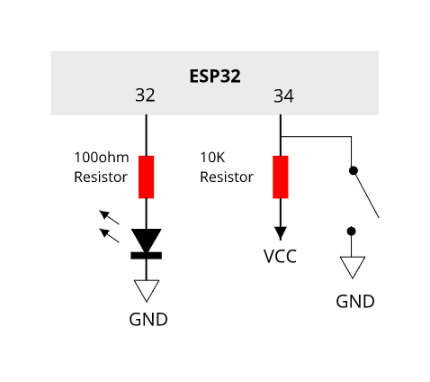

# Dramabox ESP32 HTTP client

An example that sends button status to a server on the internet over wireless

## Requirements

- ESP32 board
- 1x LED
- 2x Resistors
- A button / switch / piece of wire
- A breadboard

## Diagram



GPIOs
- **34** - Switch (active low)
- **32** - Wireless LED (active high)

## Setup Guide

1. First get a working install of ESP-IDF (see the documentation [here](https://esp-idf.readthedocs.io/en/latest/get-started/index.html)). You will need to install the toolchain and the libraries

2. If you dont have it, save the following script to `~/esp/bootstrap.sh`
```
#!/bin/bash
export PATH="$PATH:$HOME/esp/xtensa-esp32-elf/bin"
export IDF_PATH="$HOME/esp/esp-idf"
export PS1="\[\e[31m\][esp32]\[\e[m\] $PS1"
echo "ESP32 environment variables set"
```
then source it to set up your enviroment -> `. ~/esp/bootstrap.sh`

3. Check out the source directory and `cd dramabox_http_client`

4. Run `make menuconfig`. The main things you want to change are:
   - Your SSID / Password under `Example Configuration`
   - Your serial port used for programming under `Serial flasher config`

5. Run `make flash` to flash your ESP32

6. Run `make monitor` to see the debug logs. `Ctrl-]` to exit

7. Close the switch and it will call the server with the status of the switch
